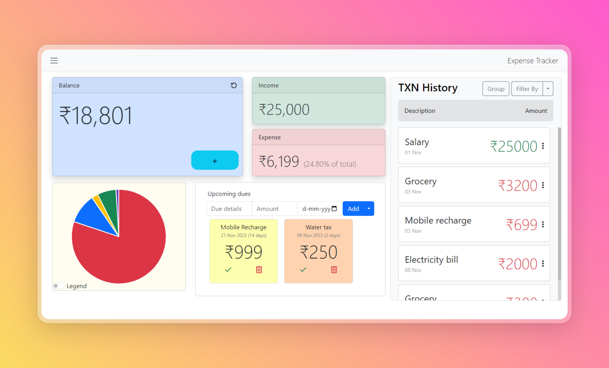

<div align='center'>
  <h1>Expense/Income tracker</h1>
  <a href='https://github.com/Subaash1706/Expensetracker'>View Demo</a>
  |
  <a href='https://github.com/Subaash1706/Expensetracker/issues'>Report Bug</a>
  |
  <a href='https://github.com/Subaash1706/Expensetracker/issues'>Request feature</a>
</div>
</br>
<div align='center'>
  <div>
    
  </div>
</br>
  <a href='https://www.linkedin.com/in/subaash-b-646646238/' target="_blank"></a>
  <p>A Responsive Expense/Income tracker to help users keep track of their transactions.</p>
</div>
<hr>
<a href='https://github.com/Subaash1706/Expensetracker'></a>

 ## Table of contents
 - [Key features](/#key-features)
 - [Built with](#built-with)
 - [Installation](#installation)
 - [Author](#author)

 ## Key features
 
 - Effortless tracking, management and categorization of the expenses and income data.

 - Utilizes ChartJS library to display financial data in the form of pie-chart offering a visual representation of the user's financial breakdown.
 - Dashboard provides a quick and detailed snapshot of the user's recent financial activity. Data other than the current month are neglected to keep the view relevant, however, data older than a month are available within the annual expense section(refer last point).
 - Dashboard data can be grouped based on the description of the transaction made and can be filtered by nature of the transaction made(Expense/Income).
 - Allows full control over the current month's financial data. Add, Edit or Remove data from the dashboard whenever necessary 
 - Supports recurring expenses(like mobile bills, electricity bills) and implemented logic to remind about the same to avoid missing due dates.
 - Annual data visualization from offcanvas to gain visualization of the user's long-term financial data.

## Built with
  - HTML
  - CSS
  - Javascript
  - Bootstrap
  - TessearactJs
  - ChartJs

## Installation

- Fork this repo
- Clone the repo from your repositories
  
  ```sh
  git clone <forked-repo-link>
  ```
  
- Open with your editor
  
  ```sh
  code .
  ```
  
- Nothing to install, CDN links have direclty been provided in the HTML file itself. So, find the ```index.html``` file and run it with the help of Live server.
### Author
<b>👤 Subaash</b>
- Twitter [@Subaashbalamurugan](https://twitter.com/subaashbala)
- LinkedIn [@Subaash B](https://www.linkedin.com/in/subaash-b-646646238/)
- Github [@Subaash1706](https://github.com/Subaash1706/)
</br>
Feel free to contact me incase of bugs, issues or queries.

## Note
No need to setup a server as for now.  But backend processes are still undergoing and I hope that the data could be stored in the database soon.
